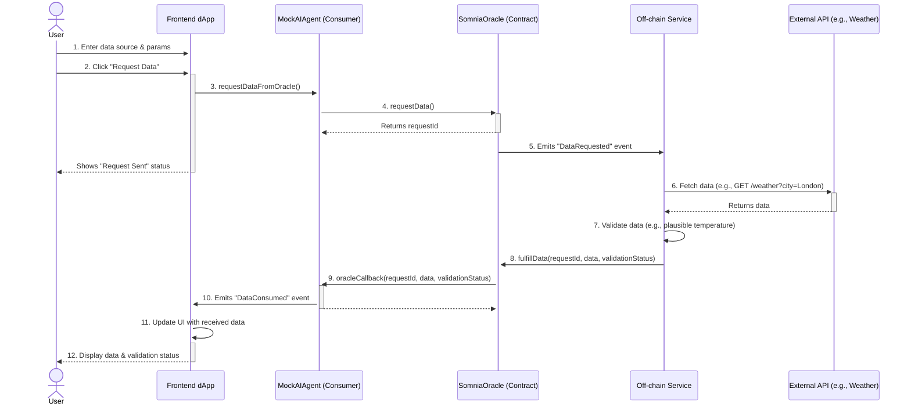

#  OracleMind - AI Data Oracle & Validation Layer for Somnia

**OracleMind is a foundational infrastructure project for the Somnia AI Hackathon, building a robust and verifiable data oracle specifically designed for on-chain autonomous AI agents.**

> Autonomous AI agents operating on the Somnia blockchain require access to reliable, real-world data to make informed decisions. This project solves the fundamental "oracle problem" by providing a secure and validated bridge between the off-chain world and Somnia's on-chain AI agents, unlocking a new dimension of intelligent, autonomous capabilities.

---

## Architecture Diagram

The following diagram illustrates the end-to-end flow of a data request, from the user interacting with the dApp to the final data delivery.



---

## Core Functionality

1.  **Decentralized Data Requests:** AI agents on Somnia request off-chain data (e.g., weather, market prices) through the `SomniaOracle` smart contract.
2.  **Off-chain Validation:** A Node.js service listens for requests, fetches data from external sources, and performs validation to ensure integrity.
3.  **Secure On-chain Fulfillment:** The validated data is pushed back to the `SomniaOracle`, which delivers it to the requesting AI agent via a callback.
4.  **Enhanced AI Capabilities:** By providing verifiable external data, OracleMind empowers Somnia's AI agents to operate with greater intelligence and relevance to real-world events.

---

## Technologies Used

-   **Smart Contracts:** Solidity, Foundry
-   **Frontend dApp:** Next.js, TypeScript, Viem, RainbowKit, shadcn/ui
-   **Off-chain Oracle Service:** Node.js, TypeScript, Viem, Axios

---

## Deployed Contract Addresses (Somnia Testnet)

-   **SomniaOracle Contract:** `0x94E7b61ACfdDA06c74A8e56Fc55261AF94bda9f6`
-   **MockAIAgent Contract:** `0xE398011BfD41E94e4BF40E1Df64e0960F1E37A2C`

---

## Setup and Installation

### Smart Contracts

1.  Navigate to the `contracts` directory: `cd contracts`
2.  Install Foundry dependencies: `forge install`
3.  Compile contracts: `forge build`
4.  Run tests: `forge test`

### Off-chain Oracle Service

1.  Navigate to the service directory: `cd contracts/oracle-service`
2.  Install dependencies: `npm install`
3.  Create a `.env` file (see `.env.example` or the section below) and add your private key and API keys.
4.  Run the service: `npm run start`

<details>
<summary><strong>Click to expand `.env` configuration</strong></summary>

```
# Somnia Testnet RPC URL
SOMNIA_RPC_URL=YOUR_SOMNIA_TESTNET_RPC_URL

# Private key of the wallet that will send transactions to the SomniaOracle contract.
# This address must be the one passed into the SomniaOracle constructor.
# IMPORTANT: Do NOT commit this file with a real private key to a public repository!
ORACLE_SERVICE_PRIVATE_KEY=YOUR_ORACLE_SERVICE_PRIVATE_KEY

# API Key for OpenWeatherMap
OPENWEATHER_API_KEY=YOUR_OPENWEATHER_API_KEY

# Deployed SomniaOracle Contract Address
SOMNIA_ORACLE_CONTRACT_ADDRESS=0x94E7b61ACfdDA06c74A8e56Fc55261AF94bda9f6
```
</details>

### Frontend dApp

1.  Navigate to the `frontend` directory: `cd frontend`
2.  Install dependencies: `npm install`
3.  Run the development server: `npm run dev`
4.  Open [http://localhost:3000](http://localhost:3000) in your browser.

---

## 🎬 Demo Video

https://www.loom.com/share/c1b2b026a1fc44be8a130e247863b8fd

Deployment : https://oracle-mind-three.vercel.app/

---

## Future Enhancements

-   Support for multiple data sources and complex data types.
-   Consensus from multiple oracle nodes for enhanced security.
-   A reputation system for oracle service providers.
-   Deeper integration with complex AI agent logic beyond a mock consumer.
